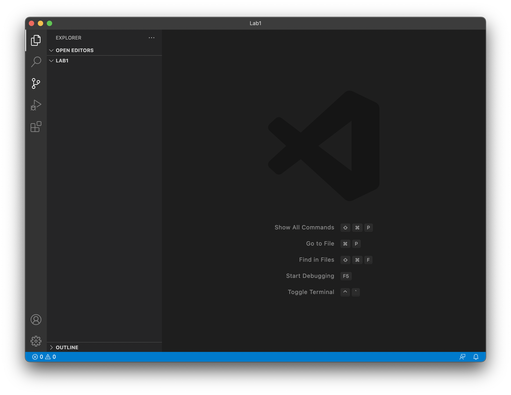

# *Lab Report 1 - Week 2*
**Written by Nicholas Crawley**

## Installing VSCode
* Go to [https://code.visualstudio.com/](https://code.visualstudio.com/) and download Visual Studio Code.
* Once it is installed on your computer, open Visual Studio Code. You should see a window like the one below.
