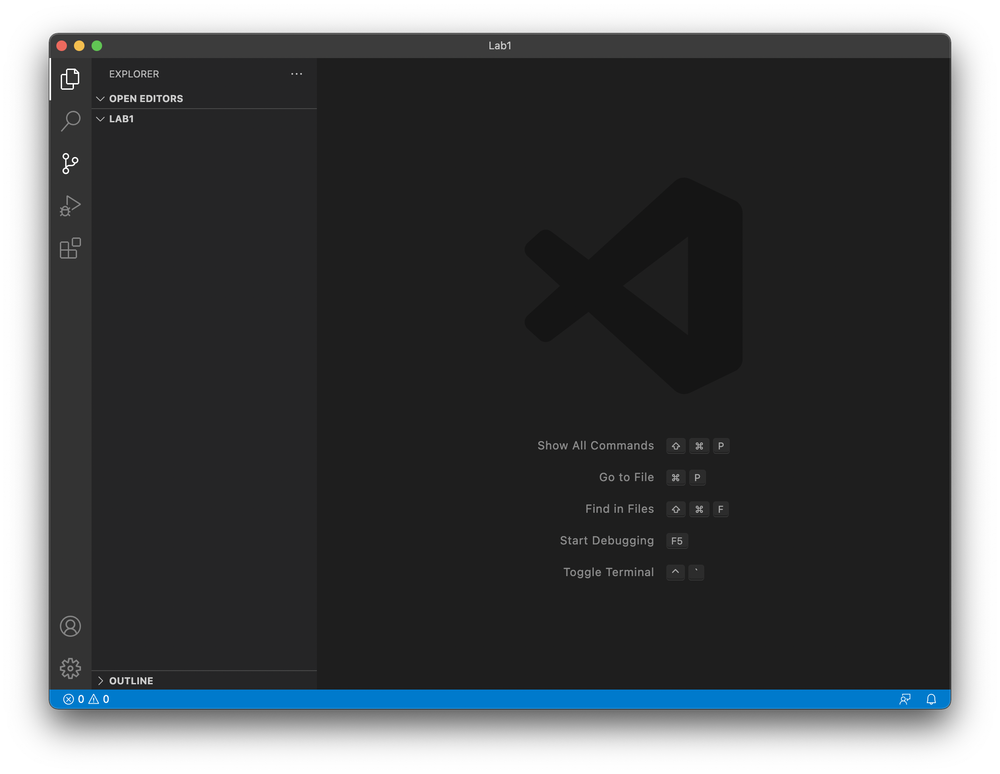
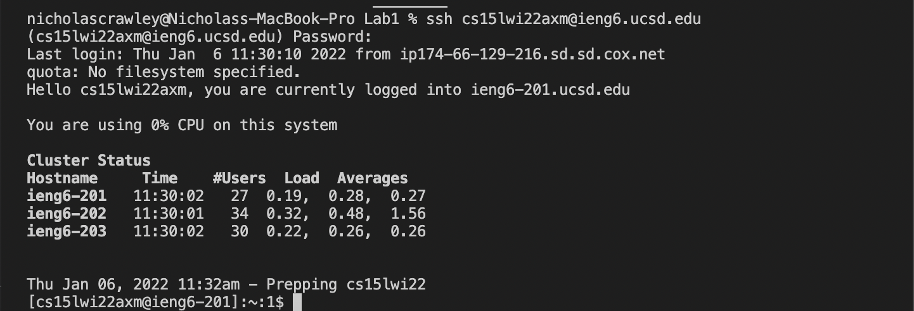

# *Lab Report 1 - Week 2*
**Written by Nicholas Crawley**

## Installing VSCode
* Go to [https://code.visualstudio.com/](https://code.visualstudio.com/) and download Visual Studio Code.
* Once it is installed on your computer, open Visual Studio Code. You should see a window like the one below.


## Remotely Connecting
* Next, click on the Terminal tab and open a new terminal.
* Write the following command in the terminal. **(Put the letters unique to your account in the blank)**
```
ssh cse15lwi22___@ieng6.ucsd.edu
```
* This command lets you connect to the ieng6 server. (If this your first time connecting to the ieng6 server, you will get a message asking if you want to connect. Type yes.)
* The terminal should look like this once you're connected.
