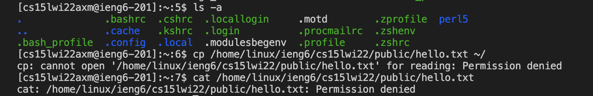
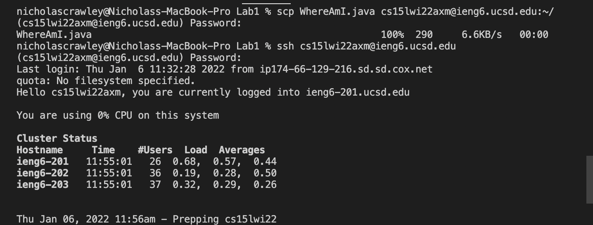
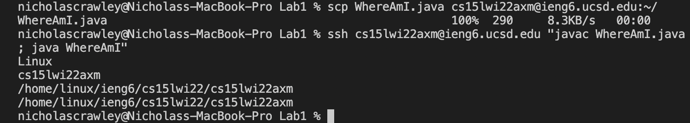

# *Lab Report 1 - Week 2*
**Written by Nicholas Crawley**

## Installing VSCode
* Go to [https://code.visualstudio.com/](https://code.visualstudio.com/) and download Visual Studio Code.
* Once it is installed on your computer, open Visual Studio Code. You should see a window like the one below.


## Remotely Connecting
* Click on the Terminal tab and open a new terminal.
* Write the following command in the terminal. **(Put the letters unique to your account in the blank)**
```
ssh cse15lwi22___@ieng6.ucsd.edu
```
* This command lets you connect to the ieng6 server. (If this your first time connecting to the server, you will get a message asking if you want to connect. Type yes.)
* Once you enter your password, you will be connected to the ieng6 server.


## Trying Some Commands
* Write some commands in the terminal. You can use **cd**, **cp**, **ls**, **mkdir**, and **pwd**.
* Other examples include:
```
ls -a
```
```
cp /home/linux/ieng6/cs15lwi22/public/hello.txt ~/
```
```
cat /home/linux/ieng6/cs15lwi22/public/hello.txt
```


## Moving Files with **scp**
* Create a file called **WhereAmI.java** and write the following:
```
class WhereAmI {
  public static void main(String[] args) {
    System.out.println(System.getProperty("os.name"));
    System.out.println(System.getProperty("user.name"));
    System.out.println(System.getProperty("user.home"));
    System.out.println(System.getProperty("user.dir"));
  }
}
```
* Write the command below:
```
scp WhereAmI.java cs15lwi22zz@ieng6.ucsd.edu:~/
```
* This command will copy **WhereAmI.java** from your local computer to your remote computer.
* Use the **ssh** command again to access the remote computer and run the file using **javac** and **java**.


## Setting an SSH Key
* You can use an **ssh** key to avoid having to type your password every time you want to connect to a server. Write the following:
```
ssh-keygen
```
* After you follow the prompts, you will have a private and public key on your computer. Connect to your ieng6 account and write the following:
```
mkdir .ssh
```
* Log out of your ieng6 account and write the following to copy the public key to the .ssh directory:
```
scp /Users/<you>/.ssh/id_rsa.pub cs15lwi22@ieng6.ucsd.edu:~/.ssh/authorized_keys
```
* Now you should be able to connect to your remote computer without typing in your password every time.


## Optimizing Remote Running
* Write the following commands:
```
scp WhereAmI.java cs15lwi22zz@ieng6.ucsd.edu:~/
```
```
ssh cs15lwi22___@ieng6.ucsd.edu "javac WhereAmI.java; java WhereAmI"
```
* You can use the up arrows in the terminal after making changes to save the file on your remote computer.

