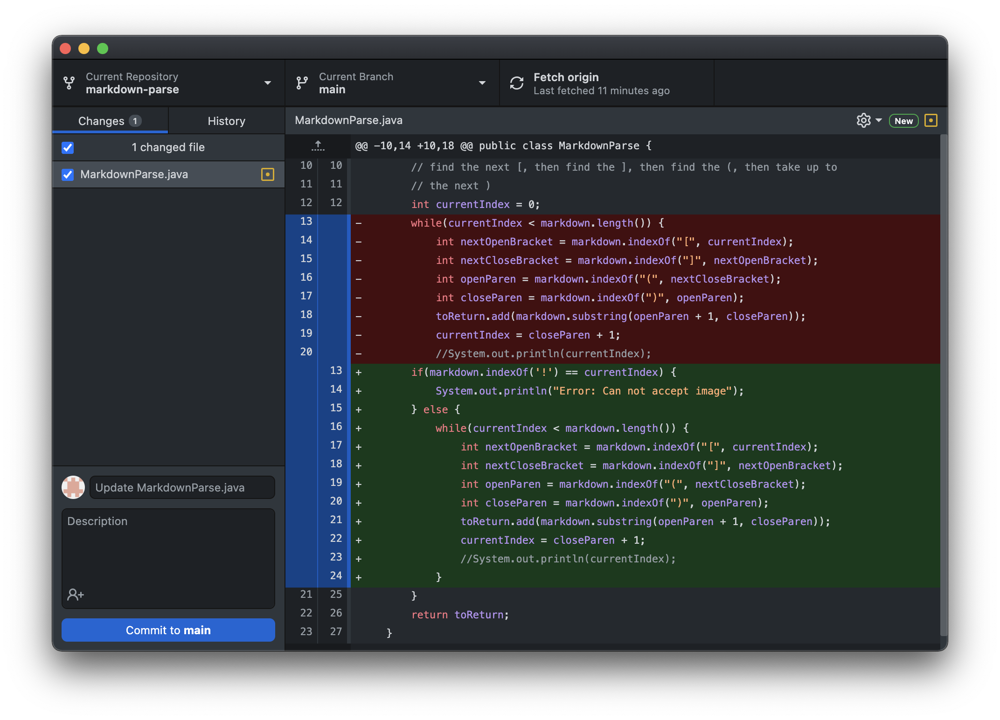
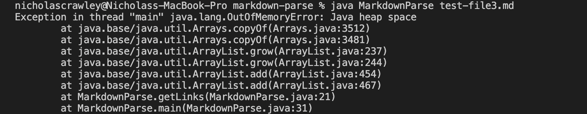

# *Lab Report 2 - Week 4*
**Written by Nicholas Crawley**

## Code Change 1
* *Code Change Diff*

* [*Test File Link*](test-file2.md)
* *Symptom*

* This program is intended to print links, not files with image references. The change to code now has it looking for an exclamation point at the very beginning of a line and displays an error message.

## Code Change 2
* *Code Change Diff*

* [*Test File Link*](test-file3.md)
* *Symptom*

* The test file had parenthesis in unexpected locations. It resulted in running out of memory.

## Code Change 3
* *Code Change Diff*

* [*Test File Link*](test-file4.md)
* *Symptom*

* When encountering nothing between the parenthesis, the program displays nothing between the brackets. The output should instead be an error message telling the user the file has no links.
