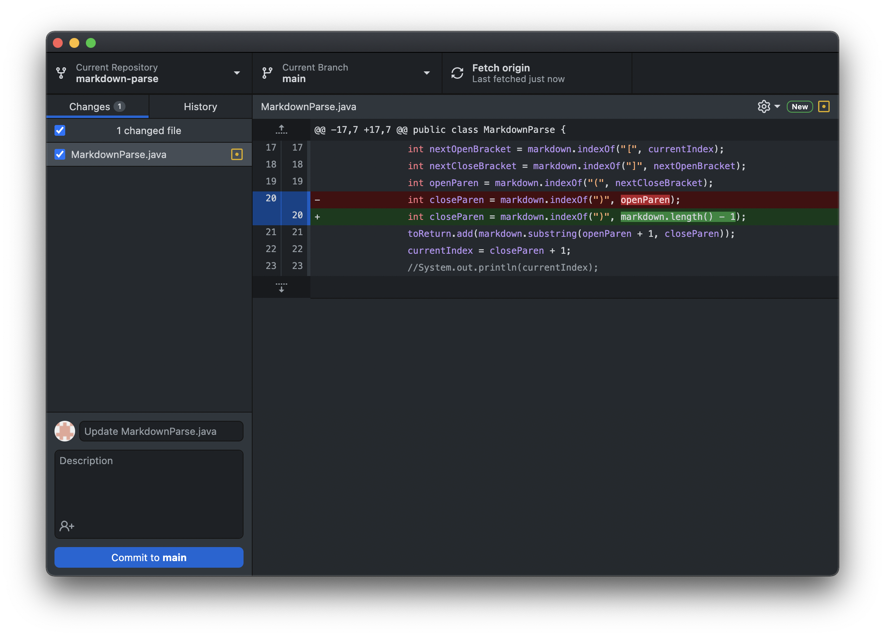

# *Lab Report 2 - Week 4*
**Written by Nicholas Crawley**

## Code Change 1
* *Code Change Diff*

* [*Test File Link*](https://nchlscrawley.github.io/cse15l-lab-reports/test-file2.html)
* *Symptom*

* This program is intended to print links, not files with image references. The new code has it looking for an exclamation point at the beginning of the line and displays an error message.

## Code Change 2
* *Code Change Diff*

* [*Test File Link*](https://nchlscrawley.github.io/cse15l-lab-reports/test-file3.html)
* *Symptom*

* The link in the test file had a closing parenthesis in an unexpected location, resulting in memory running out. The new code looks for a closed parenthesis at the end of the line, then prints the link.

## Code Change 3
* *Code Change Diff*

* [*Test File Link*](https://nchlscrawley.github.io/cse15l-lab-reports/test-file4.html)
* *Symptom*

* When encountering nothing between the parenthesis, the program displays nothing between the brackets. The output should instead be an error message telling the user the file has no links.
