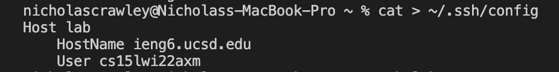
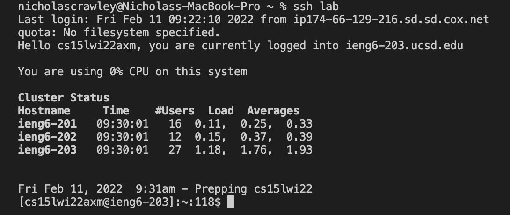
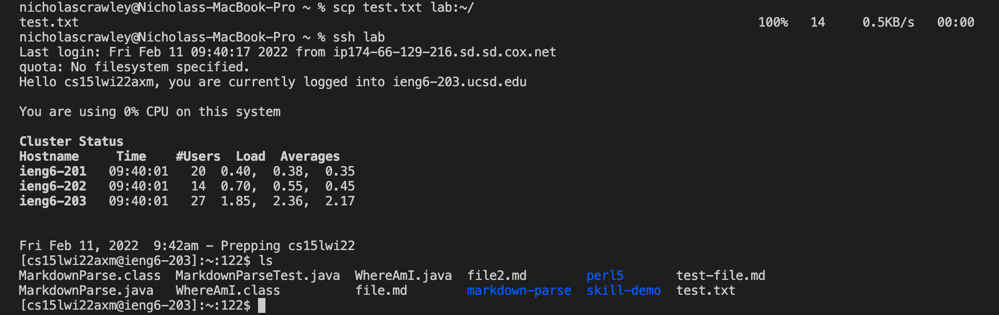

# *Lab Report 3 - Week 6*
**Written by Nicholas Crawley**

## Streamlining ssh Configuration
* First, I opened the following file:
```
~/.ssh/config
```
* The contents I added to the file include information that is needed in an **ssh** command:
```
Host _alias_
    HostName ieng6.ucsd.edu
    User cs15lwi22___
```

---
* Now, I can use **ssh** followed by *lab*, the **alias** I used in place of my remote server. This makes writing **ssh** commands much faster.

---
* **scp** commands are easier to write too. After creating a file, I used **scp**, followed by the name of my file, and at the end of the command is my **alias**. I was able to successfully transfer my file from my personal computer to my remote computer.

