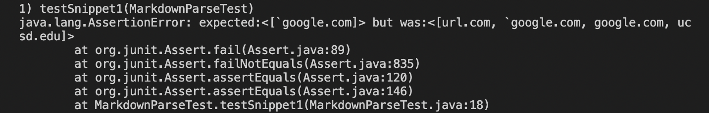
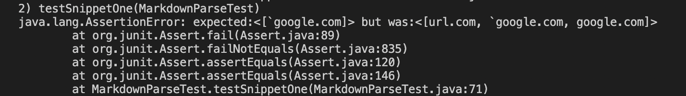
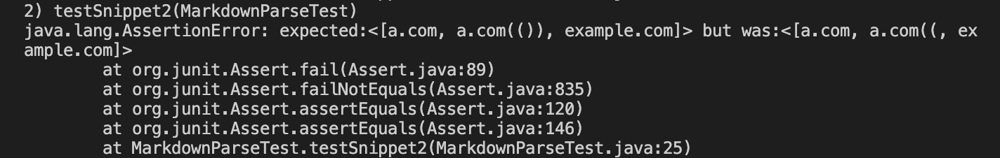
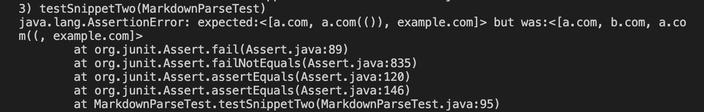
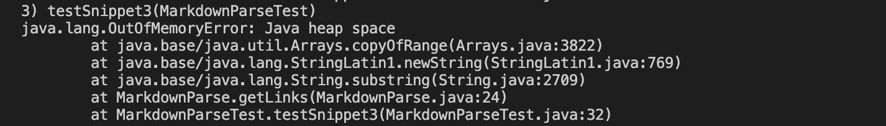
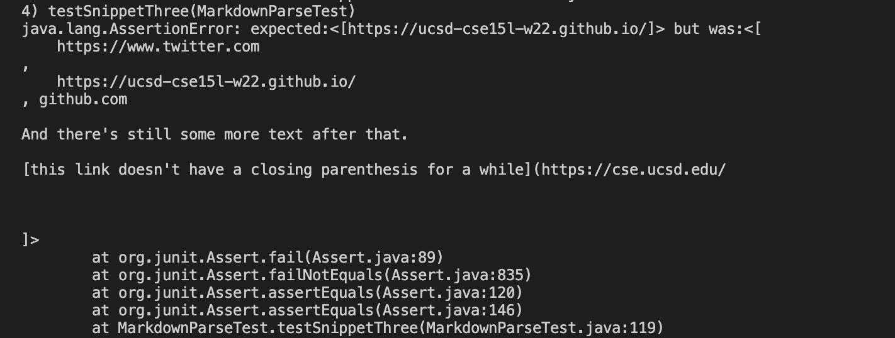

# *Lab Report 4 - Week 8*
**Written by Nicholas Crawley**

## Repositories
* My Repository: [https://github.com/nchlscrawley/markdown-parse](https://github.com/nchlscrawley/markdown-parse)
* *jordan-nishi*'s Repository: [https://github.com/jordan-nishi/markdown-parse](https://github.com/jordan-nishi/markdown-parse)

## Snippet 1
```
`[a link`](url.com)

[another link](`google.com)`

[`cod[e`](google.com)

[`code]`](ucsd.edu)
```
* Output should only produce the second link:
```
[`google.com]
```
* From my repository, the output displayed all four links in the snippet. I think a code change of 10 lines or less is possible, as most of the errors involve misplaced brackets and parentheses.

* From *jordan-nishi*'s repository, the output displayed the first three links.


## Snippet 2
```
[a [nested link](a.com)](b.com)

[a nested parenthesized url](a.com(()))

[some escaped \[ brackets \]](example.com)
```
* Output should produce the first, third, and fourth links:
```
[a.com, a.com(()), example.com]
```
* From my repository, the output displayed the first and third of the expected links correctly, but did not include the ending parentheses for the second link, **a.com(())**. I think a code change of 10 lines or less is possible. Similar to snippet 1, most of the errors involve misplaced brackets and parentheses, in addition to too many parentheses.

* From *jordan-nishi*'s repository, the output displayed all four links.


## Snippet 3
```
[this title text is really long and takes up more than 
one line

and has some line breaks](
    https://www.twitter.com
)

[this title text is really long and takes up more than 
one line](
    https://ucsd-cse15l-w22.github.io/
)


[this link doesn't have a closing parenthesis](github.com

And there's still some more text after that.

[this link doesn't have a closing parenthesis for a while](https://cse.ucsd.edu/


)

And then there's more text
```
* Output should only produce the second link:
```
[https://ucsd-cse15l-w22.github.io/]
```
* From my repository, the output displayed an out of memory error message. I think a code change would involve more than 10 lines, as there are a lot of errors within this snippet and would likely require a substantial amount of code.

* From *jordan-nishi*'s repository, the output displayed the first two links and everything from **github.com** to the last ending parenthesis.

