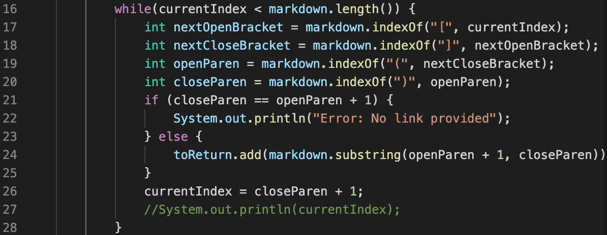

# *Lab Report 5 - Week 10*
**Written by Nicholas Crawley**

## Method
Initially, I manually searched through all 652 tests, as a significant number of them resulted in errors. When I did encounter tests that I could use, I edited *script.sh* to include the tests I wanted to use. Then, I used **diff** to look for different results.

## Test 1
* My Implementation's Output:

* Lab 9 Implementation's Output:

* Of the two implementations, I think mine displays the correct output, as this program is not supposed to accept files with image references.
* The Lab 9 implementation displays **uri1**, when it should display an error when encountering a file with an image reference. An if statement looking for an exclamation point at the beginning of the line can be written before the while loop below.

## Test 2
* My Implementation's Output:

* Lab 9 Implementation's Output:

* While I think both implementations are not completely correct, I think the part of my implementation's output that displays an error message stating no link is provided, is the correct output.
* While I think my implementation does contain the correct output, it also follows that with an out of memory error. Line 24 of my code would need to be fixed below.

